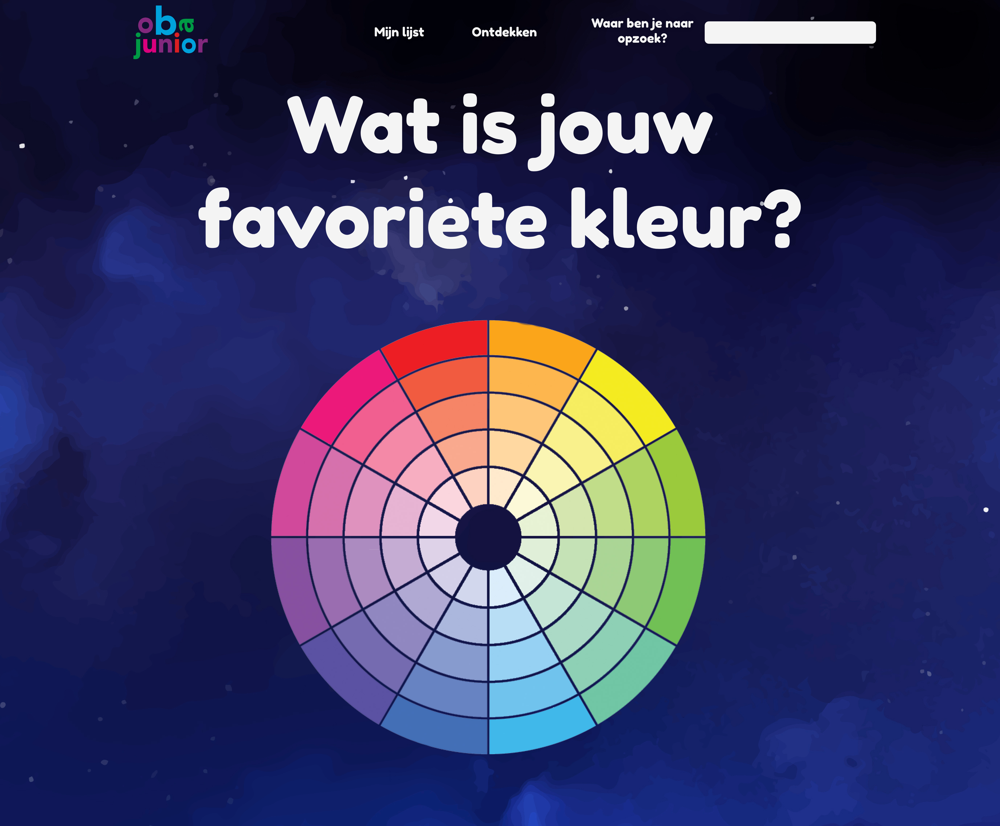

# Project 1 @cmda-minor-web · 2018-2019

**For this project I worked on a concept for the Oba Junior, a department of the Oba. While creating this concept I had to use the Oba API and apply the knowledge that I aquired during Web-App-From-Scratch and CSS-To-The-Rescue**

**!NOTE that the application is in Dutch, because the Oba is a Dutch website**


## Table of Contents
* [How to install](#how-to-install) 
* [OBA API](#oba-api)
* [Concept](#concept)
* [Walktrough the application](#walk-trough-the-application) 
* [Learning process](#learning-process)
* [Resources](#resources)
* [Credits](#credits)
* [Checklist](#checklist)
* [License](#license)

## How to install

Before installing make sure you have installed the latest version of npm.
Choose or make a new directory.
Load the template into your directory.

```bash
git clone https://github.com/chelseadoeleman/project-1-1819.git
```

Make sure you are in the right directory 
```bash
cd project-1-1819
```

Check if you have the latest version of npm.
Install the dependencies in [package.json](./package.json)
```bash
npm install
```

## OBA API

This is my second time working with the Oba API and it's still as tedious as ever. Thanks to Wouter's Oba-wrapper it's a lot more manageable. Thankyou very much! This saved me a lot of time. Some facets I would like to take a closer look at are the `target-audience` and `reading-level` manly because I would like to make an application for the Oba Junior. Here you can find childrens book till 12 years. After that you will get to the Young Adults section.

Some thing I ran into while retrieving the data was applying multiple facets to the query. In the end it finally worked. Another thing that seemed a little odd was when I applied the `targetAudience` facet I still got some questionable books, that definitely don't belong in the youth section. `p=jeugd` did work to only retrieve youth books, but alas didn't seem to work with the oba-wrapper. However it is definitely a valid property in the search query.


## Concept 

For this concept I will solely focus on Oba Junior. To make searching books easier for them I want to create an application where they can visually choose what preferences they have for a book, or what they are looking for. This will then be connected to their personal data, where their history also can be found. This dataset however is not publicaly available yet so I might have to fake this data if I have the time to do so. 

After this process the user will be able to scan a book and get a selections of books based on their previous reading history or based on some genre's they have read before to discover new books. And add them to their list. The discover function in the applications asks the user some question and based on those answers configures a whole discover page, with books hopefully to their liking. 

These questions are based on the following facets that can be given to the searchQuery. Such as their reading level or format they are looking for. But the most important part is genre, where they can choose from multiple images their favorite one. Based on that image the most prominent color in that picture will be picked and a genre facet will be applied to the searchQuery. 

The target group can also pick their favorite color from a colorpicker which will include all those shades that are associated with that color. From there on the different colors they chose from genre as from the colorpicker will be compared to the covers of the books. 



The end result will be books that they like and hopefully some covers that speak to them on a personal level. 
Sadly I wasn't able to build this all within one week, but this will be the final concept.

## Walktrough the application

This is the first page you will come across, which is basically showing you an overview of the different books that are available in the Oba youth department. When clicking on 'Ontdekken' the user will be asked a series of questions. 


First they have to choose their genre based on what image speaks to them the most. Behind every image there is a different query.


After this they can choose the format they would like. It could be a readingbook, audiobook or an movie. Somehow with the Oba wrapper I wasn't able to get movies, so I disabled that button for now.


Kids mostly read books of a certain level that applies to them. So in this section they get to choose their own reading level if they would like to. Right know this feature doesn't work yet so the buttons are disabled.


Then they will get an overview of a page, with books that will probably most apply to them. 


## Learning process

I had a very hard time coming up with a concept which I was able to make in a weeks time. So in the end I settled for a basic concept with not much going on and no unique selling point. Halfway through the week I took another look at my concept and tried to come up with something more appropriate for my target audience. Luckily I already started to build my application else I would get into some serious trouble because of my limited amount of time.

Firstly I dove deep into the Oba-wrapper, because I already worked with the Api I did know the different endpoints however because of the wrapper working with the Api was slightly different and took some time to figure out. After that I decided to make some designs, because in this assignment it is not only about Web App From Scratch but also about CSS To The Rescue. Which made everything even more difficult and kinda stressed me out a bit. 

On wednesday I completely configured my Router and had a basic page set-up. Then I also found out that the final presentation of the project is also about concepting. While I still had nothing cool at that point. Luckily the standup that day was really helpfull for me. And I came up with an idea to match the book color with an image chosen by the target audience. The building process of that feature was again easier said than done. After shifting through multiple Javascript libraries I found a function that worked with canvas. However the function [getColor](./client/src/js/utils/getColor.js) doest not work with images from another domain. With the Oba Api that is definitely the case even after I tried putting `https://cors-anywhere.herokuapp.com/` before the image url it still didn't work. 

On thursday I configured different search query's depending on an image of the users choosing. The logic of this can be found in multiple files importing the function [getQueryState.js](./client/src/js/utils/getQueryState.js). After I configured this logic I mainly focussed on styling instead of features, which probably will take up more time and break a lot of code. 


## Resources

#### Packages
*   [Parcel](https://parceljs.org/)
*   [Babel-polyfill](https://babeljs.io/docs/en/babel-polyfill)
*   [Oba-wrapper](https://github.com/maanlamp/OBA-wrapper#codepromisestreamcatch-function-handler---promisestreamcode)
*   [Navigo](https://github.com/krasimir/navigo)

#### Sources
*   [getAverageRGB color](https://stackoverflow.com/questions/2541481/get-average-color-of-image-via-javascript)
*   [Readme van Daniel](https://github.com/DanielvandeVelde/functional-programming/blob/master/README.md)

#### API
*   [OBA API](https://zoeken.oba.nl/api/v1/#/search)

#### Images
*   [Background](https://www.rawpixel.com/image/393625/abstract-splashed-watercolor-textured-background)
*   [Rocket](https://www.rawpixel.com/image/458341/launch-start-website)
*   [Dieren](https://www.rawpixel.com/image/44671/wildlife-animal-cartoons)
*   [Dragon](https://www.freepik.com/free-vector/dragon-knight-legend-illustration-flat_2874357.htm)
*   [Wereld](https://www.freepik.com/free-vector/animal-world-map_3129717.htm)
*   [Soccer](https://www.freepik.com/free-vector/soccer-stadium-illustration_3297808.htm)
*   [Basketbal](https://www.freepik.com/free-vector/boys-playing-basketball-illustration-black-afro-american-kid-with-ball-school-gymnasium_3264819.htm)
*   [Dungeon](https://www.freepik.com/free-vector/illustration-with-medieval-prison-cell-castle-dungeon-room-prisoners_3586246.htm)
*   [Princess](https://www.freepik.com/free-vector/princess-with-castle-flat-design_896777.htm)
*   [Unicorn](https://www.rawpixel.com/image/515603/unicorn-taking-bath-vector)


## Credits
* **Wouter** Obviously because of doing so much work on the Oba-wrapper which saved me a lot of time and work! And also providing a good readme that explained almost everything.
* **Daniel** To help configure my search query with multiple facets. 
* **Maikel** For helping with the [getColor](./client/src/js/utils/getColor.js) function and most of my questions.


## License
This repository is licensed as [MIT](LICENSE) by [Chelsea Doeleman](https://github.com/chelseadoeleman).

